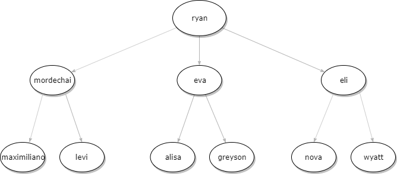

# NSA Codebreaker 2019

## Task 1
1. Open pcap in wireshark
2. File -> Extract Objects -> HTTP -> Save all
3. This includes a readme and an apk
4. The readme contains the client ID's and secrets
5. sha256sum to get the sha256 of the apk

## Task 2
1. extract.sh to solve

## Task 3
1. Column xsip = XMPP hostname
2. Column asip = OAUTH hostname
3. https://whatismyipaddress.com/hostname-ip

## Task 4
1. Use decrypt_lib.py to crack the pin
2. Run the emulator and install the app
3. ```/adb push ~/codebreaker2019/task3/clientDB.db /data/data/com.badguy.terrortime/databases/clientDB.db```
-- to get the clientDB onto the emulator device
4. Run the app and login using the creds.txt
5. Mention of "picking up the cake" at 2121 (9:21pm)
6. "after veterans day" in one convo and "four days after the holiday" -> November 15
7. https://www.epochconverter.com/ to get the epochtime of November 15th at 9:21pm -- 1573852860

## Task 5
1. Use uncompyle6 to get auth_verify.py (notice there's no check for the username, just that it's a valid token)
2. Log in with account discovered in previous step
3. ```./adb pull /data/data/com.badguy.terrortime/databases/clientDB.db``` to get clientDB, which now contains value in "atok" field after successful login
4. Change the username to be whoever you want
5. Put it back with: ```./adb push ~/codebreaker2019/task5/clientDB.db /data/data/com.badguy.terrortime/databases/clientDB.db```
6. Repeat this process for all discovered users
7. Create a map of conversations to identify the leader

Here's what mine looked like: 

8. Use masq.py to generate a valid auth token
9. ```"mvn exec:java -Dexec.mainClass="com.mvn_java_client.mvn_java_client.App"``` to execute the maven project and grab the list of messages
10. The first message printed is the last one

## Task 6a
1. Use the maven project to grab the public key with VCardManager for the person you want to send a message to
2. Use VCardHelper as a guide on how to grab the public keys for a user
3. Use this, alongside with the "encryptMessage" from Crypto.Messaging to form an encrypted message. You'll need to add your public key to the message, and not the org leaders.
4. Send the message
5. Overwrite the org leader's VCard Public Key entry by using the "setField" method and providing your public key. BUT MAKE SURE TO SAVE THE KEYS THAT YOU OVERWRITE

## Task 6b
1. Repeat the process of appending to a user's public key entry using the VCard functionality discovered earlier for each user, you can automate it like I did
2. Now go and add the overwritten keys from the previous step back to the organization leader's account so they can still send messages
3. Now you can decrypt all future messages and spoof whatever you'd like
